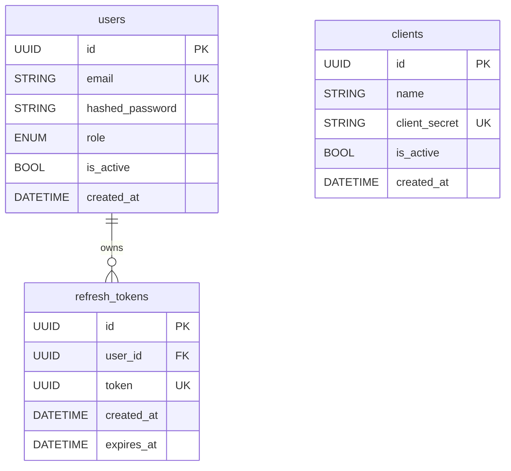

<div align="center">

# 🔑 Keyforge API

**OAuth2 authentication server built with Python and FastAPI**

JWT-based auth server with role-based access control, client management, and Redis-backed token lifecycle.

[](https://github.com/mykytakuzminov/keyforge-api/actions/workflows/ci.yml)
[](https://github.com/mykytakuzminov/keyforge-api/actions/workflows/deploy.yml)
[](https://python.org/)
[](./LICENSE)

[API Docs (Swagger UI)](http://37.27.218.231:8000/docs) · [ReDoc](http://37.27.218.231:8000/redoc)

</div>

---

## Features

- **JWT Authentication** — access token (15 min) + refresh token (7 days) stored in Redis
- **Role-Based Access Control** — Admin and Member roles with endpoint-level enforcement
- **Client Management** — full lifecycle for OAuth2 client applications with hashed secrets
- **Rate Limiting** — per-IP request throttling on auth endpoints via Redis counters
- **Async Stack** — fully async from FastAPI handlers down to SQLAlchemy and asyncpg
- **Strict Type Checking** — mypy strict mode across the entire codebase
- **Integration Tests** — real PostgreSQL and Redis via Testcontainers, auto-cleaned between runs
- **CI/CD Pipeline** — GitHub Actions: lint → type check → test → Docker build → deploy to Hetzner

---

## Tech Stack

| Layer | Technology |
|---|---|
| Language | Python 3.14 |
| Framework | FastAPI |
| Database | PostgreSQL (SQLAlchemy async + asyncpg) |
| Migrations | Alembic |
| Cache / Sessions | Redis |
| Validation | Pydantic v2 |
| Auth | JWT (python-jose) + bcrypt |
| Linting | Ruff + mypy (strict) |
| Testing | pytest + testcontainers |
| Containerization | Docker (multi-stage) + Docker Compose |
| CI/CD | GitHub Actions → GHCR → Hetzner VPS |

---

## Architecture

The project follows a three-layer architecture per domain module. Dependencies flow downward — handlers call services, services call repositories.

```
┌──────────────────────────────────────────────┐
│               FastAPI Routers                │
│   /auth  /users  /clients                   │
│   RateLimitDep · AuthDep · AdminDep          │
└───────────────────┬──────────────────────────┘
                    │  dependency injection
┌───────────────────▼──────────────────────────┐
│                 Services                     │
│   AuthService · UserService · ClientService  │
└───────────────────┬──────────────────────────┘
                    │
┌───────────────────▼──────────────────────────┐
│               Repositories                  │
│   UserRepository (PostgreSQL)                │
│   ClientRepository (PostgreSQL)              │
│   TokenRepository (Redis)                   │
└──────────────────────────────────────────────┘
```

---

## Database Schema



---

## Getting Started

**Prerequisites:** Docker, Docker Compose

```bash
git clone https://github.com/mykytakuzminov/keyforge-api.git
cd keyforge-api

cp .env.example .env

docker compose up -d

docker compose exec app .venv/bin/alembic upgrade head
```

API: `http://localhost:8000`
Swagger: `http://localhost:8000/docs`

```bash
# Run tests (spins up Testcontainers automatically)
uv run pytest tests/
```

---

## CI/CD

```
Pull Request → dev
  ├── lint (ruff) · type check (mypy) · test (pytest)

Merge to main
  ├── Build Docker image (multi-stage)
  ├── Push to GHCR (:latest + :<sha>)
  └── Deploy to Hetzner via SSH
```

---

## Environment Variables

| Variable | Description | Default |
|---|---|---|
| `DATABASE_URL` | Async PostgreSQL URL | required |
| `ALEMBIC_DATABASE_URL` | Sync PostgreSQL URL (migrations) | required |
| `REDIS_URL` | Redis connection URL | required |
| `SECRET_KEY` | JWT signing secret | required |

See [`.env.example`](./.env.example) for the full list.

---

## License

[MIT](./LICENSE)
